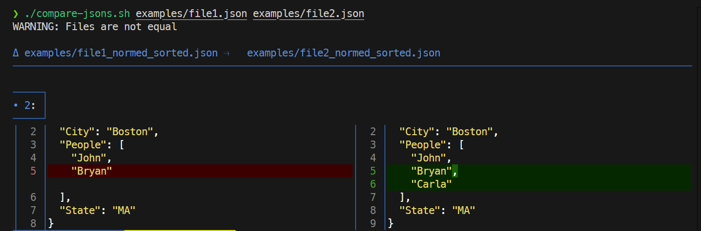

# compare-jsons

A script for fast visual comparsion of 2 json files.

Сompares files line by line.

Automatically normalizes JSON data and sort keys before comparing.


## Preparation

Install tools:
- [jq](https://jqlang.org/)
- [delta](https://github.com/dandavison/delta)


## Run script

```sh
./compare-jsons.sh ./examples/file1.json ./examples/file2.json
```

Script result example:



